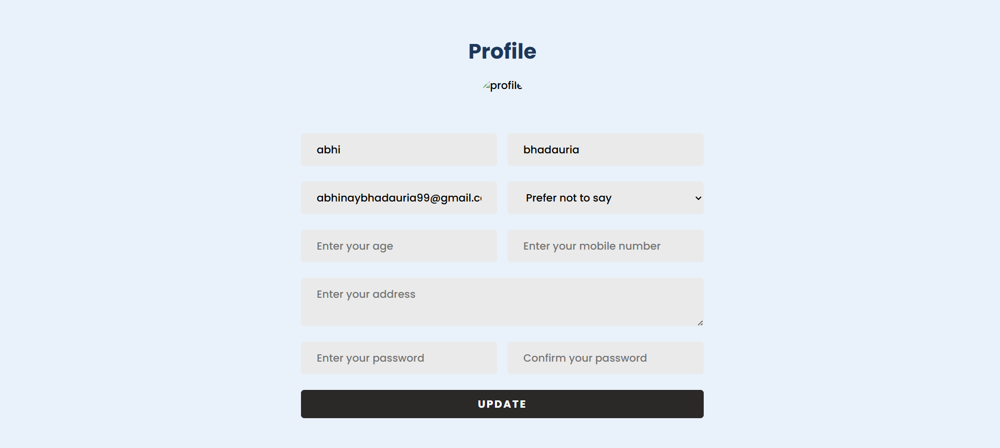

# Deployment Details

## Frontend Deployment Link:
[[Deployment LINK](https://humao-bundelkhand-22ht.vercel.app/)]

## Backend Deployment Link:
[[Deployment LINK](https://humao-bundelkhand.vercel.app/)]

## Issue Notice:
Although both the frontend and backend are deployed successfully, they are not connecting due to some issue. However, for better understanding, images of the working project on a local machine are provided below.

## Project Screenshots:

### Hero Page:


### All Registered Gayaks:


### Looged In user Bookings for Lokgeet:


### Looged In user's Notifications:


### Application for Becoming a Gayak (Logged-in Users Only):


### Profile of Logged-in User:


---

## Environment File Structure

### Backend (.env file):
```
MONGO_URI= [Your MongoDB connection string]
JWT_SECRET= [Your JWT secret key]
PORT= [Your backend server port]

# Cloudinary Configuration
CLOUD_NAME= [Your Cloudinary cloud name]
API_KEY= [Your Cloudinary API key]
API_SECRET= [Your Cloudinary API secret]
```

### Frontend (.env file):
```
REACT_APP_SERVER_DOMAIN= [Backend server domain]
```

---

Ensure that these environment variables are correctly set in your deployment environment to avoid connectivity issues.
